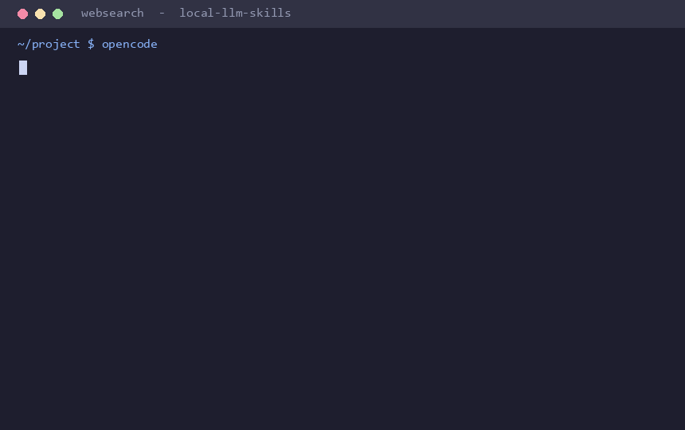

# local-llm-skills

**Give your *local* LLMs the context they're missing: what tools are on your machine, how to
run them, how to install missing ones, and how to search the web — without burning your tiny
context window.**

Built for **[LM Studio](https://lmstudio.ai)** and **[opencode](https://opencode.ai)** running
small local models (4B–9B), where every token counts. One shared skill library serves both apps.

---

## The problem

Local models don't know what's installed on your PC. Paste a 7,000-token "here are my tools"
doc into a 10k context window and there's no room left to think. So they hallucinate flags,
pick tools you don't have, and can't search the web or install what's missing.

## The fix: progressive-disclosure skills

A **skill** is a folder with a `SKILL.md`. Both LM Studio (via its *Skills* plugin) and
opencode load only each skill's one-line **name + description** at rest — a few hundred tokens
total. The model pulls the *full* instructions for a domain into context **only when a task
needs it**. 14 skills cost almost nothing idle; you pay for the 1–2 actually in use.

```
~/.lmstudio/skills/            <- single source of truth (LM Studio reads this)
        |
        +--(directory junction)--> ~/.config/opencode/skill/   (opencode reads this)
```

## What's included

| Skill | What it gives the model |
|---|---|
| **local-tools** | Your machine's identity, the PowerShell gotchas, and a map to every other skill. **Auto-generated for your machine** by `scan-tools.ps1`. |
| **install-tools** | How to find & install missing tools (winget / choco / scoop / pip-uv / npm / cargo) and verify. |
| **web-search** | A **keyless, zero-dependency** Python web search + page reader (`web_search.py`). No API key, no flaky plugin. |
| media-ffmpeg · audio-sox-tts · images-magick-gimp · documents-pandoc · python-ml-libs · video-apps · android-adb · git-github · containers-k8s · network-crypto · archives-files | Exact, copy-pasteable commands for each tool domain. |

The standout piece: **`scan-tools.ps1` detects what's actually installed on *your* machine**
and writes a personalized `local-tools` primer — so the model gets your real toolbox, your GPU's
encoder, your shell, not someone else's.

## Native tool plugins (better than the flaky web-search plugins)

Skills are great, but for web search a **native tool** is better still — the model calls it
directly, with no shell-command confirmation and structured results. This repo ships two,
both keyless and dependency-light:

| Plugin | For | Tools | Install |
|---|---|---|---|
| [`opencode/tool/websearch.ts`](opencode/tool/websearch.ts) | opencode | `websearch` | Copy to `~/.config/opencode/tool/` — **no build step** (opencode runs it natively) |
| [`lmstudio-plugin/web-search-plus`](lmstudio-plugin/web-search-plus) | LM Studio | `web_search`, `fetch_url` | `npm install` then `lms dev --install -y` |

**Why they're better:** the common web-search plugins `POST` to DuckDuckGo, which now returns
an **HTTP 202 anti-bot page** (so they quietly return nothing). These use the **`GET`** endpoint
that still works, fall back to the `lite` endpoint, decode DDG's redirect links, capture
snippets, and — for LM Studio — add a `fetch_url` page-reader the others don't have.

**Optional heavier-duty backends.** DuckDuckGo (keyless) is the default and needs nothing. If you
want higher-quality / higher-volume search, both plugins can use **Tavily** (free tier) or a
**SearXNG** instance, and fall back to DuckDuckGo automatically if it's not configured or fails:

- **LM Studio:** in the plugin's settings, set _Search backend_ to Tavily/SearXNG and put the API
  key / instance URL in the plugin's **global** settings.
- **opencode:** set an env var before launching — `TAVILY_API_KEY=...` or `SEARXNG_URL=https://...`.

## Autonomy (work without constant approval)

Small local models shouldn't get blanket "approve everything," so the kit uses **graduated
autonomy**: auto-run anything read-only or reversible, gate only what's destructive or
outward-facing.

```powershell
./setup/enable-autonomy.ps1     # applies it (idempotent; backs up what it edits)
opencode --agent auto           # opencode's hands-off mode
```

This adds an opencode `permission` block (allow safe bash + edit/web, **deny** `rm`/`format`/
`reset --hard`/force-push, **ask** for `git push`/installs), a graduated-autonomy `AGENTS.md`, a
switchable `auto` agent, and — in LM Studio — auto-approval of the *sandboxed/read-only* tools
while the host shell stays gated. Two skills (`verify-work`, `task-discipline`) make the model
verify its own work and recover from errors instead of needing a babysitter.

**Full details + manual steps + headless/unattended operation:** [`docs/autonomy.md`](docs/autonomy.md).

## Examples



> _The GIF is generated by [`docs/make_demo_gif.py`](docs/make_demo_gif.py) (Pillow only) — re-run it to regenerate._

**LM Studio** — ask something that needs current info; the model calls the tools itself:
```
You:  What's the newest stable FFmpeg release and one notable change?
  -> web_search("latest FFmpeg stable release 2026")
  -> fetch_url("https://ffmpeg.org/download.html")
Model: FFmpeg <x.y> "<name>" is current. Notable: <change>. (source: ffmpeg.org)
```

**opencode** — the `websearch` tool (or the `/websearch` command):
```
> /websearch amd rx 6600 ffmpeg hevc encoding flags
1. Hardware/AMF - FFmpeg            https://trac.ffmpeg.org/wiki/Hardware/AMF
2. Recommended FFmpeg Encoder ...   https://github.com/GPUOpen-LibrariesAndSDKs/AMF/...
Model: Use -c:v hevc_amf with -rc cqp -qp_i 22 -qp_p 24 ... (source: trac.ffmpeg.org)
```

**Skills auto-loading** — no command needed; the model pulls the right skill on its own:
```
You:  convert intro.mov to a small h265 mp4 using my gpu
  (model loads the media-ffmpeg skill, sees this PC = AMD)
Model: ffmpeg -hwaccel d3d11va -i intro.mov -c:v hevc_amf -rc cqp -qp_i 22 ... out.mp4
```

## Quick start

1. **LM Studio:** install the *Skills* plugin (search the Hub for `skills`). opencode needs no plugin.
2. Clone this repo and run the installer (close LM Studio first):
   ```powershell
   git clone https://github.com/Onica5000/local-llm-skills.git
   cd local-llm-skills
   ./setup/setup.ps1
   # optional: point it at a long tools doc you keep
   # ./setup/setup.ps1 -ReferenceFile "C:\path\to\my-tools.md"
   ```
   This copies the skills in, raises the LM Studio skill cap to 30, junctions opencode to the
   same folder, and runs the scanner to personalize `local-tools`.
3. Restart LM Studio / start `opencode`, then ask: *"what tools do I have for video encoding?"*
   or *"search the web for the latest Blender release."*

### opencode `/websearch` command (optional)
Copy `opencode/command/websearch.md` to `~/.config/opencode/command/` for a native
`/websearch <query>` slash command. (`setup.ps1` does not install this automatically.)

## Web search by itself

`skills/web-search/scripts/web_search.py` is standalone and dependency-free:
```powershell
python web_search.py "your query"              # search
python web_search.py --fetch "https://..."     # read a page as plain text
python web_search.py "query" --json            # machine-readable
```

## Customize

- Skills are just Markdown — edit any `SKILL.md` to taste, or add your own folder with a
  `SKILL.md` + `skill.json`.
- Re-run `./setup/scan-tools.ps1` any time your installed tools change.
- The domain skills contain example commands; the **commands** are universal, but tweak any
  absolute paths to match your installs.

## How it works (deeper)

See [`docs/how-it-works.md`](docs/how-it-works.md).

## Notes

- Targets **Windows + PowerShell 5.1** (the common LM Studio setup). The skills' *commands*
  are cross-platform where the tools are; the setup scripts are Windows-specific.
- `SKILL.md` is an open standard also read by Claude Code, Cursor, Codex, and Gemini CLI.

## License

MIT — see [LICENSE](LICENSE).
